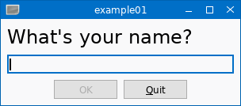

# lwtk - Lua Widget Toolkit
[](LICENSE)
[](https://github.com/osch/lua-lwtk/actions/workflows/test.yml)
[](https://luarocks.org/modules/osch/lwtk)

This toolkit provides a foundation for building cross platform GUI widgets in
pure [Lua] on top of [LPugl]. For now only the cairo drawing backend is supported. 
Backend abstraction and support for other backends could be possible in the
future.

This project is work in progress. First aim is to provide a basic infrastructure
for creating and customizing widgets. Second aim is to implement a reasonable set 
of standard widgets. So far only very simple standard widgets are provided, e.g. 
`lwtk.TextInput` and `lwtk.PushButton`.

<!-- ---------------------------------------------------------------------------------------- -->

#### Supported platforms: 
   * Linux (X11)
   * Windows
   * Mac OS X 


<!-- ---------------------------------------------------------------------------------------- -->

#### Further reading:
   * [Documentation](doc/README.md)
   * [Examples](./example/README.md#lwtk-examples)

<!-- ---------------------------------------------------------------------------------------- -->

## First Example

* The first example demonstrates a simple dialog using the `lwtk.TextInput` widget.
  The appearance of the widgets is configured in [lwtk.DefaultStyle](src/lwtk/DefaultStyle.lua).
  The key bindings are configured in [lwtk.DefaultKeyBinding](src/lwtk/DefaultKeyBinding.lua).

     

    ```lua
    local lwtk = require("lwtk")
    
    local Application    = lwtk.Application
    local Column         = lwtk.Column
    local Row            = lwtk.Row
    local PushButton     = lwtk.PushButton
    local TextInput      = lwtk.TextInput
    local TitleText      = lwtk.TitleText
    local Space          = lwtk.Space
    
    local app = Application("example01.lua")
    
    local function quit()
        app:close()
    end
    
    local win = app:newWindow {
        title = "example01",
        Column {
            id = "c1",
            TitleText { text = "What's your name?" },
            TextInput { id = "i1", focus = true, style = { Columns = 40 } },
            Row {
                Space {},
                PushButton { id = "b1", text = "&OK",   disabled = true, 
                                                        default  = true },
    
                PushButton { id = "b2", text = "&Quit", onClicked = quit },
                Space {}
            }
        },
        Column {
            id = "c2",
            visible = false,
            Space {},
            TitleText { id = "t2", style = { TextAlign = "center" } },
            Space {},
            Row {
                Space {},
                PushButton { id = "b3", text = "&Again" },
    
                PushButton { id = "b4", text = "&Quit", default = true,
                                                        onClicked = quit },
                Space {}
            }
        }
    }
    
    win:childById("c1"):setOnInputChanged(function(widget, input)
        widget:childById("b1"):setDisabled(input.text == "")
    end)
    
    win:childById("b1"):setOnClicked(function(widget)
        win:childById("t2"):setText("Hello "..win:childById("i1").text.."!") 
        win:childById("c1"):setVisible(false)
        win:childById("c2"):setVisible(true)
    end)
    
    win:childById("b3"):setOnClicked(function(widget)
        win:childById("i1"):setText("")
        win:childById("i1"):setFocus()
        win:childById("c1"):setVisible(true)
        win:childById("c2"):setVisible(false)
    end)
    
    win:show()
    
    app:runEventLoop()
    ```

<!-- ---------------------------------------------------------------------------------------- -->

[lua]:                      https://www.lua.org/
[lpugl]:                    https://github.com/osch/lua-lpugl#lpugl

<!-- ---------------------------------------------------------------------------------------- -->
