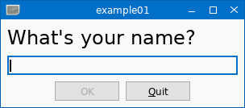

# lwtk Examples
<!-- ---------------------------------------------------------------------------------------- -->

   * [`example01.lua`](./example01.lua)
     
     This example demonstrates a simple dialog using the `lwtk.TextInput` widget.

     
     

<!-- ---------------------------------------------------------------------------------------- -->

   * [`example02.lua`](./example02.lua)
     
     
     

<!-- ---------------------------------------------------------------------------------------- -->

   * [`example10.lua`](./example10.lua)
     
     This example shows how a simple button widget class `MyButton` can
     be implemented by deriving from the base class `lwtk.Widget`.

     
     

<!-- ---------------------------------------------------------------------------------------- -->

[OOCairo]:                  https://luarocks.org/modules/osch/oocairo
[LuaGL]:                    https://luarocks.org/modules/blueowl04/opengl
[enhanced LuaGL rockspec]:  https://github.com/osch/luarocks-build-extended/blob/master/example/opengl-1.11-2.rockspec
[lua-nanovg]:               https://luarocks.org/modules/xavier-wang/nanovg

<!-- ---------------------------------------------------------------------------------------- -->
